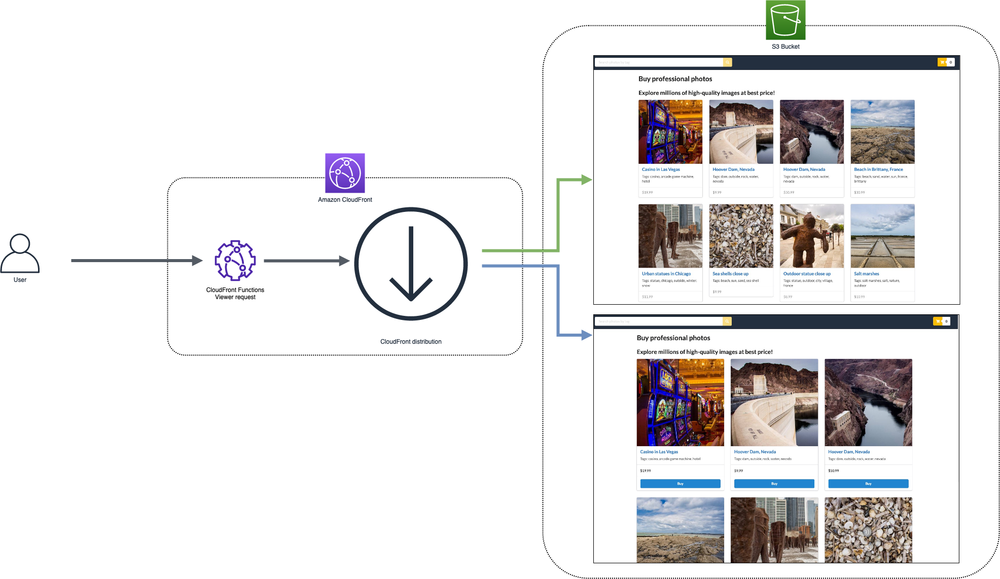
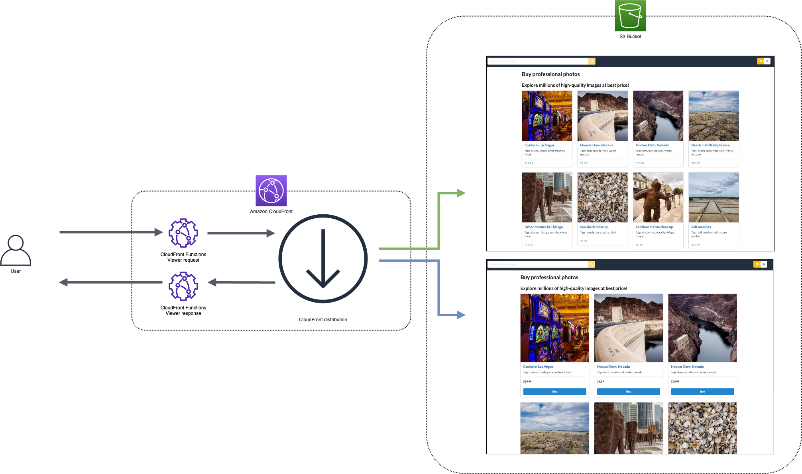
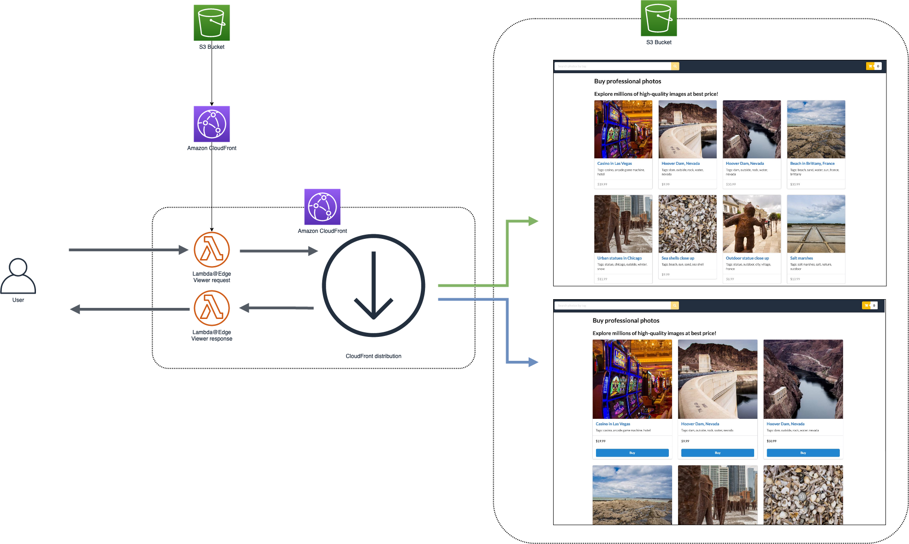
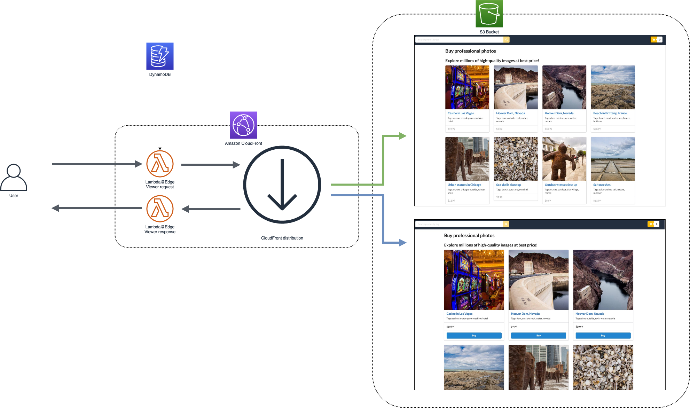

# A/B testing at the edge for e-commerce

## Goal

Demonstrate how to implement an A/B testing solution for an e-commerce website.

We explore the use of edge computing, which is between the browser and the backend, to provide processing close to where data is generated. This workshop lets you run code closer to users of your application, which improves performance and reduces latency, through the use of three services:

- [AWS Lambda@Edge](https://aws.amazon.com/lambda/edge) runs your code globally at AWS locations close to your users, so you can deliver full-featured, customized content with high performance, and low latency.
- With [AWS CloudFront Functions](https://docs.aws.amazon.com/AmazonCloudFront/latest/DeveloperGuide/cloudfront-functions.html) in Amazon CloudFront, you can write lightweight functions in JavaScript for high-scale, latency-sensitive CDN customizations. The CloudFront Functions allows you to run lightweight JavaScript code at the [218+ CloudFront edge locations](https://aws.amazon.com/cloudfront/features/?whats-new-cloudfront.sort-by=item.additionalFields.postDateTime&whats-new-cloudfront.sort-order=desc#Global_Edge_Network) (as of August 2021).
- [Amazon CloudFront](https://aws.amazon.com/cloudfront) delivers your content through a worldwide network of data centers called edge locations. The regional edge caches are located between your origin web server and the global edge locations that serve content directly to your viewers.

## Structure

The three testing scenarios presented are **Random A/B**, **Sticky Random A/B**, and **External Switch A/B** and you can deploy each the module independently.

## Architecture

We have an e-commerce website for selling digital images and we want to modify the layout of the home page in order to see if more visitors will click on a image and potentially buy it when they arrive on the new layout versus the old layout.

The architecture our website is the following:


The static resources (html, javascript, css and images) are hosted on S3 and we can imagine having APIs for the dynamic part. We will concentrate on the static part, so our website has only the static part implemented.

The home page (A version) looks like this:


The new layout (B version) has the images on three columns, a buy button and looks like this:


To test the new layout, we want to show it only to a small percentage of visitors. Based on the success of failure of the new layout we would like to be able to increase/decrease this percentage of visitor getting the new layout.

We can achieve this in multiple ways and this is what we will see through several modules.

The 3 main modules demonstrate the usage of the following AWS services:

- [Amazon CloudFront](https://aws.amazon.com/cloudfront): the fast and secure content delivery will be performed by a CloudFront distribution
- [AWS Lambda@Edge](https://aws.amazon.com/lambda/edge): cookie setting and url rewriting
- [AWS CloudFront Functions](https://docs.aws.amazon.com/AmazonCloudFront/latest/DeveloperGuide/cloudfront-functions.html): cookie setting and url rewriting
- [Amazon DynamoDB](https://aws.amazon.com/dynamodb): the dynamic data will be stored in a DynamoDB table
- [Amazon S3](https://aws.amazon.com/s3): the website’s static files and segmentation configuration file will be stored in two S3 buckets

## Deployment

### Prerequisites

- [Create an AWS account](prerequisites/create_aws_account.html)
- [Create a Cloud9 Workspace](prerequisites/cloud9_workspace.html)

### Instructions

#### 1. Clone the repository

```bash
git clone https://github.com/aws-samples/ab-testing-at-edge.git
cd ab-testing-at-edge
```

#### 2. Installs the dependencies

```bash
npm install
```

#### 3. Populate the AWS environment

```bash
cdk bootstrap
```

## Module 1 - Random A/B

**Problem:**

Display randomly either the old home page either the new home page, but no more than X% of home page impressions to be my new layout.

We are using Amazon CloudFront to serve the static content hosted on S3. The existing layout is our index.html page and the new layout if our index_b.html.

We want to change dynamically the served html page to be index.html or index_b.html.

**Solution:**

Use CloudFront Function(CF2) to dynamically change the uri.

**Architecture:**

The following diagram illustrates the architecture we will implement in this modules:



**Deployment:**

```bash
cdk deploy ABWorkshopModule1
```

## Module 2 - Sticky random A/B

**Problem:**

We want to display the old layout or the new one to our visitors but we want to serve the same page to a visitor that comes back to the home page.
For every new visitor I want to decide randomly the home page to display but for an existing visitor to display the page he got the first time.

**Solution:**

We will create another CF2 (to replace the one we created on the previous module) on viewer request that will check first if there is a cookie with a page name inside, in which case the `request.uri` will be set with that value, if not it will select randomly a home page layout.
We will need a second CF2 that will be triggered at viewer response to create a cookie with the page name served in that cookie. This operation can be done also at origin level but we want to implement something completely transparent for the backend.

**Architecture:**

The following figure display the architecture we will implement in this module:



**Deployment:**

```bash
cdk deploy ABWorkshopModule2
```

## Module 3.1 - External switch A/B - S3

**Problem:**

I want to be able to change the percentage between initial homepage and the new home page without any deploying.

**Solution:**

We will use a configuration file stored in a S3 bucket so that we can modify the content as we wish.

We will replace the two CloudFront Functions by two Lambda@Edge because CloudFront functions cannot make network calls:

- one Lambda@Edge triggered at viewer-request (to look for the cookie and when not present download a configuration file from S3 to decide if initial layout or new layout should be selected)
- one Lambda@Edge triggered at viewer-response to create a cookie with the selected page name.

**Architecture:**

The following diagram illustrates the architecture we will implement in this modules:


**Deployment:**

```bash
cdk deploy ABWorkshopModule31
```

## Module 3.2 - External switch A/B - S3 and CloudFront

**Problem:**

I want to be lower the time required to download the configuration file from S3. The bucket is located in a AWS region so if I have a user from a different region, the Lambda@Edge triggered in that region should download the file from another region which can be long.

**Solution:**

We will use a CloudFront distribution in front of our S3 bucket to cache the configuration file for a certain amount of time.

**Architecture:**

The following diagram illustrates the architecture we will implement in this modules:



**Deployment:**

```bash
cdk deploy ABWorkshopModule32
```

## Module 3.3 - External switch A/B - DynamoDB

**Problem:**

I want to have the configuration stored somewhere were I could change the segmentation and seethe result in real time

**Solution:**

We will use a DynamoDB table to store the configuration.

**Architecture:**

The following diagram illustrates the architecture we will implement in this modules:



**Deployment:**

```bash
cdk deploy ABWorkshopModule33
```

## Costs

All resources created are billed based on pay-per-use principle. The estimated cost of AWS resources is **below $2** for one day.

Except for CloudFront Functions, all services used benefit from [AWS Free Tier](https://aws.amazon.com/free/) offer.

## Cleanup

Please ensure to perform the cleanup command after the completion to avoid potentially unwanted costs.

```bash
cdk destroy ABWorkshopModuleXX
```

## Intended Audience

- Developers, Solutions Architect, Project Managers
- Prior experience in Cloud Computing is required
- Basic understanding of a programming language is suitable

## License

This repository is licensed under the MIT-0 License. See the LICENSE file.

The images used by the website are provided by the author ([Corneliu Croitoru](https://twitter.com/cornel_croi)) under the [Creative Commons Attribution 4.0 International license](https://creativecommons.org/licenses/by/4.0/).

## Security

See [CONTRIBUTING](CONTRIBUTING.md#security-issue-notifications) for more information.

## License

This library is licensed under the MIT-0 License. See the LICENSE file.
